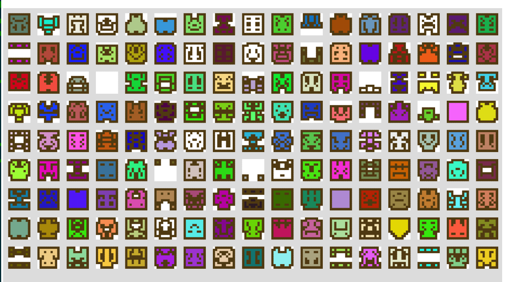

# procgen-sprite-prototype
Generating pixel sprites using cellular automata. An extension of <a href="https://github.com/yurkth/sprator">Sprator</a>'s method as it allows for variable rulesets, neighborhoods, symmetries.

# Usage
Go to the <a href="https://leungjch.github.io/procgen-sprite-prototype/">demo page</a> to see the generator in action.
 </img>

